

## תיאור הפרויקט 
עיצבנו אתר עבור לקוחה בעלת עסק של קרמיקה ותכשיטים ייחודיים ועל פי הצרכים שלה יצרנו את האתר. השתדלנו לעשות זאת ברמה גבוהה ובסטנדרטים הדומים לאלו של האתרים בארץ. ניתן לצפות ולהשתמש באתר עם כל סוגי המסכים (מחשב, אייפד ופלאפון)

## הנחות 
- הלקוחות שלנו מישראל ולכן יצרנו את האתר בעברית ואפשרנו הזנה רק של טלפון ישראלי.
- לא מימשנו את האופציה להיות אורח באתר - חייב להירשם ולהתחבר לפני שמתחילים.
- ממוצרי הקרמיקה יש רק פריט 1
- הגיל המינימלי להרשמה לאתר הינו גיל 12

## הנחיות למשתמש 
- בכניסה לאתר יש ללחוץ על האייקון של האיש בשורה למעלה על מנת להירשם לאתר. לאחר הזנת כל הפרטים האישיים, ניתן יהיה להתחבר לאתר כמשתמש פעיל ולאחר מכן ניתן לבצע רכישות.
- בדף הבית אפשר לבחור בין שני הקטגוריות (קרמיקה/תכשיטים) ובכך לעבור לדף של הCATALOG שם ניתן יהיה להוסיף לסל הקניות מוצרים וגם להיכנס למוצר ספציפי על מנת לקבל יותר ופרטים ותמונות ודרכו לבצע הוספה לסל.
- ברגע שתתבצע קנייה, מוצרי הקרמיקה שנקנו יהפכו באתר להיות לא זמינים מכיוון שיש רק מוצר אחד מכל אחד. 
- בסל הקניות ניתן להסיר מוצרים ולהוסיף עוד ממוצר שהיה בסל (של תכשיטים), כמו כן לאחר סיום הבחירה ניתן לגשת לקופה (לא מומש במסגרת הקורס).
לאחר מכן סל הקניות יתאפס. וההזמנה תתווסף לעמוד היסטוריית הרכישות.

## עמודים
### עמוד הבית
קיימת אפשרות בעמוד הבית לעבור לעמודים אחרים ע"י שימוש בסרגל העליון – בשימוש באייפד/אייפון הסרגל יהיה סרגל ניווט צידי. בכל שלב ישנה אפשרות לחזור לעמוד הבית על ידי לחיצה על 'בית' או על 'michal studio'. בעמוד ניתן לבחור אחת מבין 2 הקטגוריות – קרמיקה או תכשיטים. בנוסף, ישנה אפשרות להירשם לניוזלטר למטרות שיווק ומבצעים: נכניס את כתובת המייל שלנו בקלט ולאחר מכן נלחץ על כפתור 'איזור אישי' כאשר עבור משתמש לא מחובר יועבר להתחברות ואילו עבור משתמש מחובר יועבר לאיזור האישי. בנוסף, ישנה אפשרות הרשמה לניוזלטר.

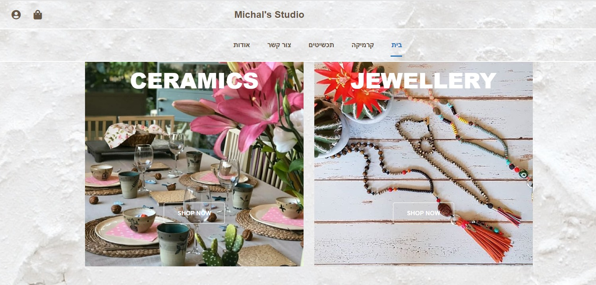
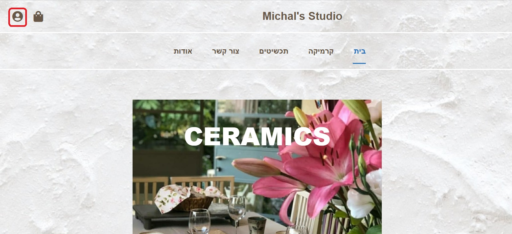
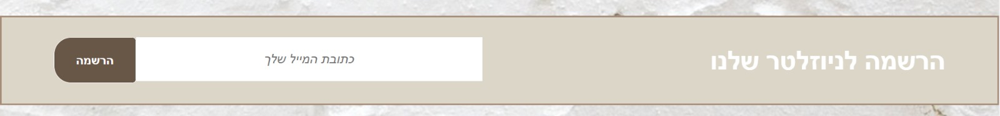
### התחברות
כל משתמש יכול להיכנס לעמוד זה על מנת לבצע תהליך התחברות לחשבון משתמש או מעבר להרשמה. לאחר ההתחברות לחשבון נעבור אוטומטית לעמוד דף הבית.
- תהליך הכניסה באמצעות גוגל - יעבוד כאשר נרצה להשיק את האתר סופית, ונשיג את הclient id של גוגל.

 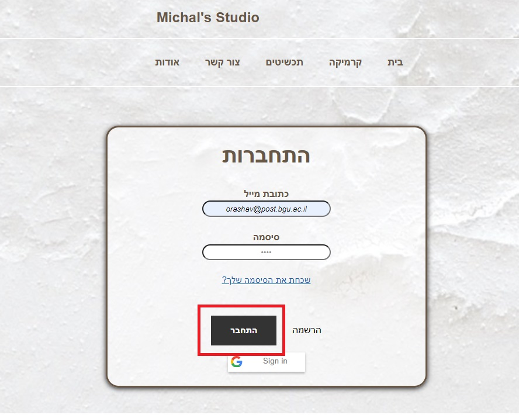

### הרשמה
כל משתמש יכול להיכנס לעמוד זה כדי לבצע תהליך יצירת חשבון משתמש חדש.
אנו מבצעים אימות מול בסיס הנתונים של כתובת המייל שאינה קיימת במערכת למשתמש קיים, עבור הזנת נתונים שלא עוברים ולידציה תופיע הודעה מתאימה בצבע אדום ואילו לאחר הרשמה מוצלחת תופיע הודעה מתאימה בצבע ירוק. 

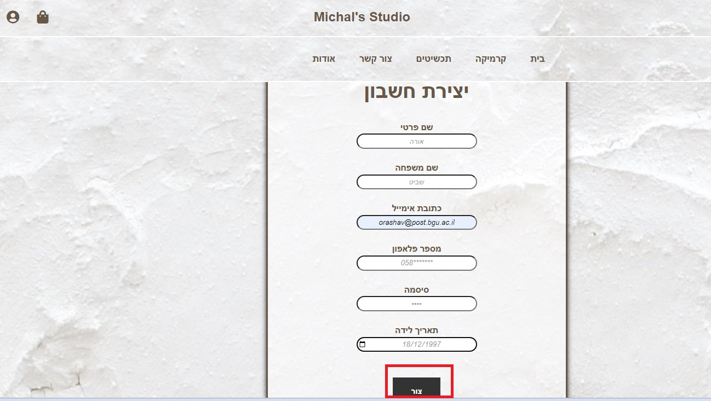
### עגלת הקניות
בפרויקט זה אפשרנו גישה לעגלת הקניות רק עבור משתמש מחובר. ניתן להסיר מוצר מסל הקניות (באמצעות כפתור הסרה), לשנות כמות פריטים עבור תכשיטים ואף להסירם (כמות אפס) ולצפות במוצרים שהוספנו לעגלה עד כה אשר זמינים במלאי. בנוסף, סך הביניים של עגלת הקניות מתעדכן לפי מחיר המוצרים והכמות שלהם בעגלה. לבסוף, ישנו כפתור מעבר לתשלום אשר אמנם לא מעביר לתשלום, אך הוא שומר את ההזמנה של המשתמש שניתן לראות באיזור האישי.

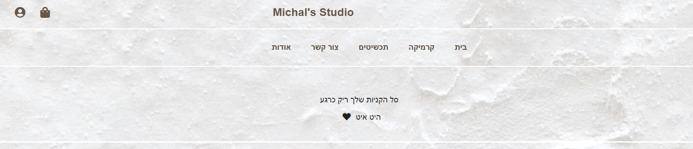
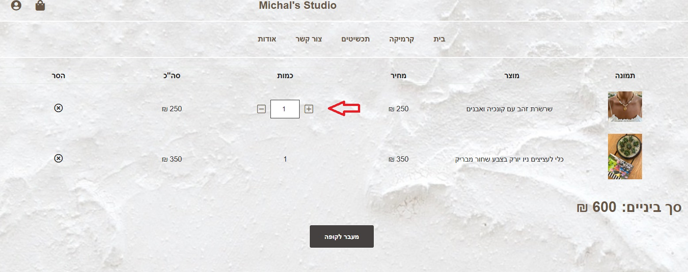
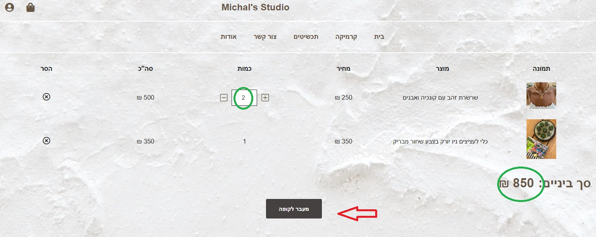
### חשבון המשתמש
 מיועד עבור לקוח מחובר בלבד, מדובר בעמוד החשבון האישי של הלקוח ובתוכו קיימת היסטוריית הרכישות שלו. בעבור משתמש מחובר, אייקון החשבון בסרגל העליון יפנה ישירות להיסטוריית הזמנות של הלקוח. בנוסף, ישנה אפשרות להתנתק מחשבון המשתמש ובעת ביצוע פעולה זו המשתמש יועבר ישירות לעמוד ההתחברות.

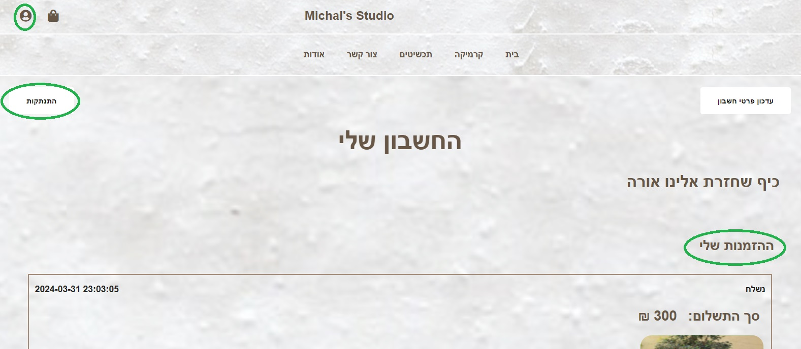
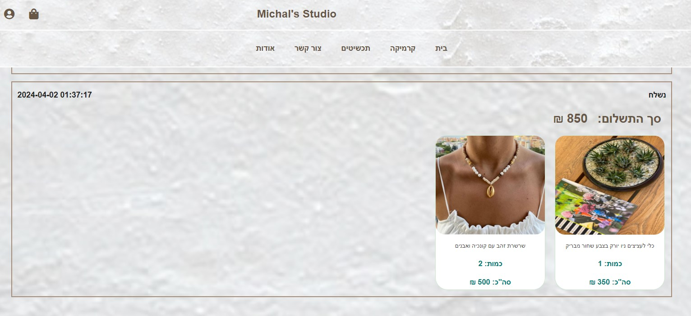
### קניות (תכשיטים וקרמיקה)
כל סוג משתמש יכול להיכנס לעמוד זה במטרה לצפות בקטלוג המוצרים (קרמיקה או תכשיטים) המוצעים למכירה, להיכנס לעמוד של המוצר עצמו ועבור משתמש מחובר ניתן להוסיף מוצר לעגלת הקניות ישירות מהקטלוג.
- היישום של המיון לא הושלם במלואו במסגרת הפרויקט.

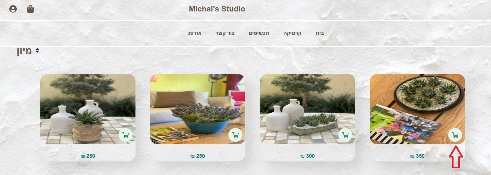
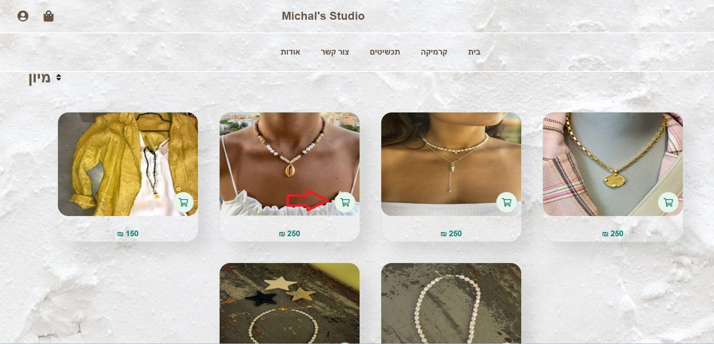

### מוצר (תכשיט וקרמיקה)
ניתן לצפות בתמונה או תמונות שונות של המוצר ולהוסיף מוצר זה לעגלת הקניות. חשוב לציין כי כל מוצר מקרמיקה הינו ייחודי במינו ולכן המוצר יתווסף רק פעם אחת לסל הקניות בניגוד לתכשיט. בנוסף, לאחר רכישה של הכמות המקסימלית מהמוצר - המוצר יעבור לסטטוס נמכר ולא תהיה אפשרות להוסיפו לסל הקניות (רלוונטי לקטלוג ולעמוד מוצר)

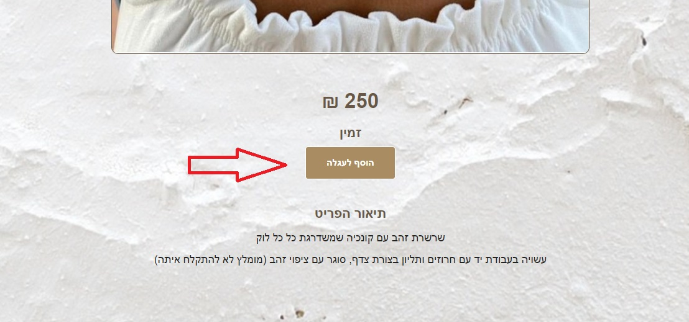
### צור קשר
ניתן ליצור קשר עם בעלת החנות ע"י מילוי פרטים שנמצאים בטופס ושליחת ההודעה. בנוסף, קיימת מפה עם מיקום הסטודיו עבור לקוחות שמעוניינים לבקר בחנות או בסטודיו. מעבר לכך, ישנה אפשרות הרשמה לניוזלטר.

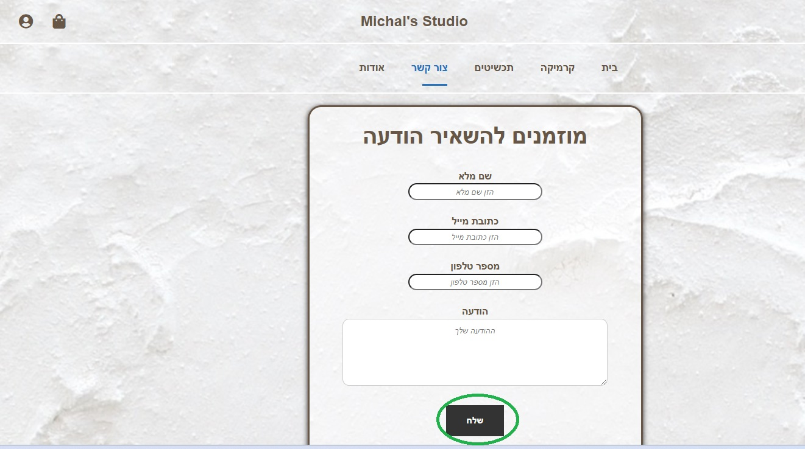

### אודות
דף זה משמש לקבלת מידע אודות העסק. בדף קישורים לכל הרשתות החברתיות ולווטסאפ של בעלת העסק. הפעלת כל קישור מתבצעת על ידי לחיצה על האייקון המתאים. 
כמו כן, ניתן להיכנס לסרטונים שמציגים תהליך הכנת כלים מקרמיקה של בעלת העסק בסטודיו על ידי לחיצה על הסרטון עצמו.

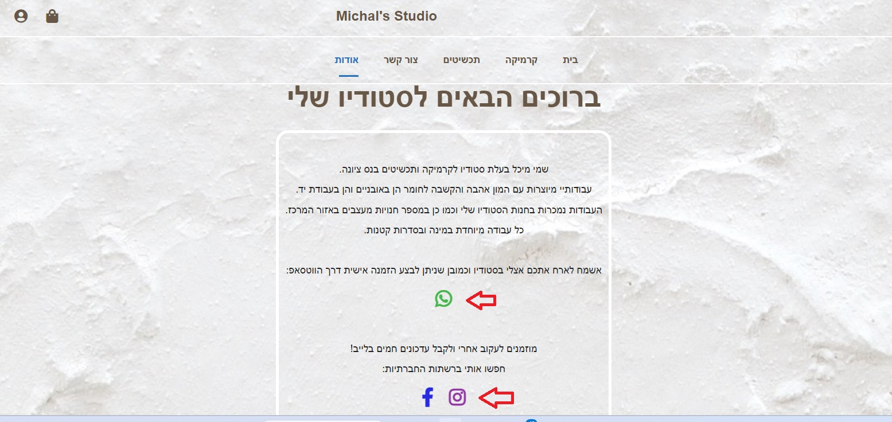

